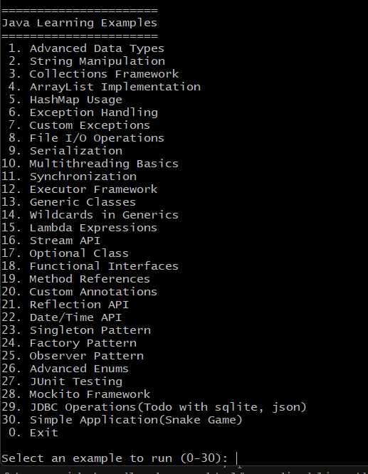
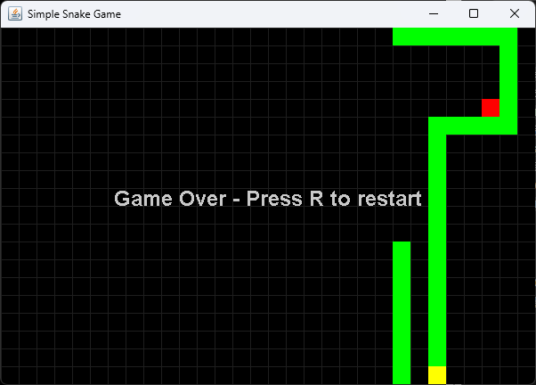

# Java Exercising using vsCode on Windows os

[](https://github.com/GithubJoshuaPark/JavaExOnWindowUsingVsCode.git)

> JDK 17

```bash
C:\Users\user>java -version
java version "17.0.15" 2025-04-15 LTS
Java(TM) SE Runtime Environment (build 17.0.15+9-LTS-241)
Java HotSpot(TM) 64-Bit Server VM (build 17.0.15+9-LTS-241, mixed mode, sharing)
```

---

```
# 프로젝트 구조 예시
JAVAEX/
├── app/
│   ├── build/
│   │   ├── classes/
│   │   │   └── java/
│   │   │       └── main/
│   │   │           └── javaex003/
│   │   │               └── App.class   👈 ← 여기에 생성됨
│   │   ├── libs/
│   │   │   └── app.jar                 👈 ← 빌드된 실행용 JAR 파일
│   │   ├── tmp/
│   │   └── reports/
│   └── src/
│       └── main/java/javaex003/App.java

```

## 1. Java 파일 작성

- `app/src/main/java/javaex/App.java` 파일 생성

```java
package javaex;
public class App {
    public static void main(String[] args) {
        System.out.println("Hello, Java World!");
    }
}
```

## 2. 프로젝트 빌드 및 실행

이 프로젝트는 **Gradle**을 사용하여 빌드되고 실행됩니다. 포함된 Gradle Wrapper를 사용하면 별도의 Gradle 설치 없이도 실행 가능합니다.

### 2.1 애플리케이션 실행 (권장)

소스 코드를 컴파일하고 즉시 실행합니다.

- **macOS / Linux**:
  ```bash
  ./gradlew :app:run
  ```
- **Windows**:
  ```cmd
  gradlew.bat :app:run
  ```

### 2.2 전체 빌드 (JAR 생성)

배포 가능한 JAR 파일을 생성합니다.

- **macOS / Linux**:
  ```bash
  ./gradlew build
  ```
- **Windows**:
  ```cmd
  gradlew.bat build
  ```
  _생성된 파일 위치: `app/build/libs/app.jar`_

### 2.3 JAR 파일 실행

빌드된 JAR 파일을 직접 실행합니다.

```bash
java -jar app/build/libs/app.jar
```

```bash
app/build/libs/app.jar
파일은 이 프로젝트의 최종 결과물인 '실행 가능한 배포 파일'
(Executable JAR, Fat JAR) 입니다.

이 파일의 핵심 용도와 특징은 다음과 같습니다:

1. 배포 및 공유 (Distribution)
    - 개발 환경(VS Code, Gradle 등)이 없는 컴퓨터에서도 Java만 설치되어 있다면
      이 파일 하나만 가지고 프로그램을 실행할 수 있습니다.
    - 친구에게 프로그램을 보내주거나, 서버에 프로그램을 띄울 때
      이 파일만 복사해서 사용합니다.

2. 모든 라이브러리 포함 (Fat JAR / Uber JAR)
    - 작성하신 소스 코드뿐만 아니라, 프로젝트 실행에 필요한
      모든 외부 라이브러리(Gson, SQLite Driver 등)가
      이 파일 하나에 모두 압축되어 포함되어 있습니다.
    - 따라서 실행할 때 복잡하게 라이브러리 경로(-cp 또는 -classpath)를
      따로 지정해 줄 필요가 없습니다.

3. 사용 예시: 터미널에서 다음과 같이 명령어 한 줄로
   프로그램을 즉시 실행할 수 있습니다.

    java -jar app/build/libs/app.jar

```

## 3. 참고

- [Java 공식 문서](https://docs.oracle.com/en/java/)
- [vsCode Java Extension](https://marketplace.visualstudio.com/items?itemName=vscjava.vscode-java-pack)
- [JDK 다운로드](https://www.oracle.com/java/technologies/javase/jdk17-archive-downloads.html)
- [Gradle 공식 문서](https://docs.gradle.org/current/userguide/userguide.html)

---

## 4. 예제 프로그램 목록 및 설명

### 기본 프로그래밍 개념

1. **Advanced Data Types** (DataTypesAdvanced)

   - Java의 고급 데이터 타입 사용 예제
   - BigInteger, BigDecimal 등 정밀 계산 타입 활용

2. **String Manipulation** (StringManipulationExamples)

   - 문자열 처리와 조작 메서드 활용
   - StringBuilder, 정규표현식 등 문자열 작업

3. **Collections Framework** (CollectionsFrameworkOverview)

   - Java 컬렉션 프레임워크 활용
   - List, Set, Map 인터페이스 사용법

4. **ArrayList Implementation** (ArrayListImplementation)

   - ArrayList 사용 방법과 활용 예제
   - 동적 배열 조작과 관리

5. **HashMap Usage** (HashMapUsageExamples)
   - HashMap을 이용한 키-값 데이터 관리
   - Map 인터페이스 실전 활용

### 예외 처리와 입출력

6. **Exception Handling** (ExceptionHandlingExamples)

   - try-catch 구문과 예외 처리
   - 다양한 예외 상황 대처 방법

7. **Custom Exceptions** (CustomExceptionsCreation)

   - 사용자 정의 예외 클래스 생성
   - 비즈니스 로직에 맞는 예외 처리

8. **File I/O Operations** (FileIOOperations)

   - 파일 입출력 작업 예제
   - 텍스트/바이너리 파일 처리

9. **Serialization** (SerializationExample)
   - 객체 직렬화와 역직렬화
   - 객체 저장과 복원 방법

### 동시성과 스레드

10. **Multithreading Basics** (MultithreadingBasics)

    - 기본 스레드 생성과 관리
    - 병렬 처리 기초

11. **Synchronization** (SynchronizationTechniques)

    - 스레드 동기화 메커니즘
    - 공유 리소스 접근 제어

12. **Executor Framework** (ExecutorFrameworkUsage)
    - 스레드 풀과 작업 관리
    - 비동기 작업 실행

### 제네릭과 람다

13. **Generic Classes** (GenericClassesDemo)

    - 제네릭 클래스 설계
    - 타입 안정성 보장

14. **Wildcards in Generics** (WildcardsInGenerics)

    - 제네릭 와일드카드 활용
    - 유연한 타입 바운드

15. **Lambda Expressions** (LambdaExpressionsDemo)
    - 람다식 문법과 활용
    - 함수형 인터페이스 사용

### 스트림과 함수형 프로그래밍

16. **Stream API** (StreamAPIDemo)

    - 스트림 연산과 파이프라인
    - 데이터 처리 최적화

17. **Optional Class** (OptionalClassDemo)

    - null 처리의 안전한 방법
    - Optional 활용 패턴

18. **Functional Interfaces** (FunctionalInterfacesDemo)
    - 기본 함수형 인터페이스
    - 커스텀 함수형 인터페이스 설계

### 리플렉션과 어노테이션

19. **Method References** (MethodReferencesDemo)

    - 메서드 참조 문법
    - 람다식 대체 활용

20. **Custom Annotations** (CustomAnnotationsDemo)

    - 커스텀 어노테이션 정의
    - 어노테이션 프로세서 활용

21. **Reflection API** (ReflectionAPIDemo)
    - 동적 클래스 조작
    - 런타임 메타데이터 활용

### 유틸리티와 디자인 패턴

22. **Date/Time API** (DateTimeAPIDemo)

    - 현대적 날짜/시간 처리
    - 시간대와 기간 계산

23. **Singleton Pattern** (SingletonPatternDemo)

    - 싱글톤 패턴 구현
    - 스레드 안전한 싱글톤

24. **Factory Pattern** (FactoryPatternDemo)

    - 팩토리 패턴 활용
    - 객체 생성 캡슐화

25. **Observer Pattern** (ObserverPatternDemo)
    - 옵저버 패턴 구현
    - 이벤트 기반 프로그래밍

### 고급 기능과 테스팅

26. **Advanced Enums** (AdvancedEnumsDemo)

    - 열거형 고급 기능
    - 열거형 메서드와 필드

27. **JUnit Testing** (JUnitTestingDemo)

    - 단위 테스트 작성
    - 테스트 케이스 설계

28. **Mockito Framework** (MockitoFrameworkDemo)

    - 목 객체 생성과 검증
    - 테스트 더블 활용

29. **JDBC Operations** (JDBCOperations)
    - 데이터베이스 연결과 쿼리
    - CRUD 작업 구현

### 실전 응용

30. **Snake Game** (SnakeGame)
    - Swing GUI 게임 구현
    - 키보드 이벤트 처리
    - 게임 루프와 상태 관리
    - 효과음 재생 (eat.wav, gameover.wav)
    - 게임 규칙:
      - 방향키로 이동
      - 먹이(빨간 점)를 먹으면 뱀이 성장
      - 자신의 몸과 충돌하면 게임 오버
      - 'R' 키로 재시작


<br>

